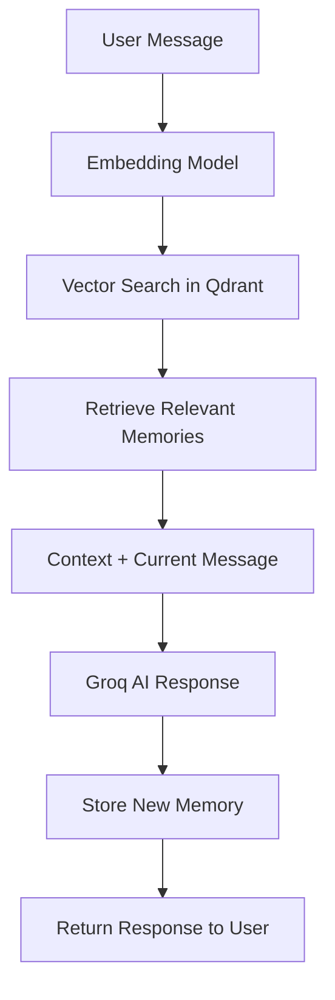

# 🧠 Manahstiti - AI-Powered Mental Health Assessment Platform

<div align="center">


**Supporting student mental wellness through intelligent assessment and AI companionship**

[](https://python.org)
[](https://flask.palletsprojects.com)
[](https://xgboost.readthedocs.io)
[](https://groq.com)
[](https://qdrant.tech)
[](https://appwrite.io)

[🚀 Live Demo](#) • [📖 Documentation](#) • [🐛 Report Bug](../../issues) • [💡 Request Feature](../../issues)

</div>

---

## 🌟 Overview

**Manahstiti** is a comprehensive mental health assessment platform designed specifically for students. It combines cutting-edge AI technology with evidence-based psychological assessment to provide personalized mental health insights and support.

### ✨ Key Highlights

- 🎯 **99.17% Accurate Assessment** - XGBoost ML model trained on comprehensive mental health data
- 🤖 **AI Friend Companion** - Empathetic chatbot powered by Groq's Llama-3.3-70B with persistent memory
- 🧠 **Intelligent Memory System** - Qdrant vector database for contextual conversations
- 🔐 **Secure Authentication** - Appwrite-powered user management with email verification
- 📱 **Responsive Design** - Modern, accessible UI that works on all devices
- 🆘 **Crisis Support** - Immediate access to mental health resources and emergency contacts

---

## 🎯 Features

### 📊 Mental Health Assessment
- **50 Evidence-Based Questions** across 5 key dimensions:
  - 😊 Mood & Emotions
  - 😰 Stress & Anxiety  
  - 😴 Sleep & Energy
  - 👥 Social & Personal Life
  - 🎓 Academic Motivation & Focus
- **Weighted Scoring System** with high-impact question identification
- **Instant Results** with personalized recommendations
- **Progress Tracking** through user dashboard

### 🤖 AI-Powered Features
- **Empathetic AI Friend** trained specifically for student mental health support
- **Contextual Memory** that remembers past conversations and concerns
- **Personalized Responses** based on assessment results and chat history
- **24/7 Availability** for immediate emotional support

### 🔐 User Experience
- **Secure Registration** with email verification
- **Professional Navigation** with user profiles and dashboards
- **Privacy-First Design** with encrypted data storage
- **Mobile-Responsive** interface for accessibility anywhere

### 🆘 Crisis Support
- **Immediate Resources** for mental health emergencies
- **Professional Referrals** based on assessment results
- **Crisis Hotlines** and emergency contact information
- **Graduated Support** from self-help to professional intervention

---

## 🚀 Quick Start

### Prerequisites

- **Python 3.8+** with pip
- **Internet connection** for API services
- **Modern web browser** (Chrome, Firefox, Safari, Edge)

### 🔧 Installation

1. **Clone the repository**
   ```bash
   git clone https://github.com/yourusername/manahstiti.git
   cd manahstiti
   ```

2. **Create virtual environment** (recommended)
   ```bash
   python -m venv venv
   
   # Windows
   venv\Scripts\activate
   
   # macOS/Linux
   source venv/bin/activate
   ```

3. **Install dependencies**
   ```bash
   pip install -r requirements.txt
   ```

4. **Set up environment variables**
   ```bash
   # Create your environment file
   cp environment.example .env
   ```

5. **Configure API keys** (see [Configuration](#-configuration) section)

6. **Run the application**
   ```bash
   python app.py
   ```

7. **Access the platform**
   ```
   🌐 Open: http://localhost:5000
   ```

---

## ⚙️ Configuration

### 🔑 Required API Keys

| Service | Purpose | Free Tier | Setup Link |
|---------|---------|-----------|------------|
| **Groq** | AI Chatbot | ✅ Yes | [console.groq.com](https://console.groq.com) |
| **Qdrant** | Memory System | ✅ Yes | [cloud.qdrant.io](https://cloud.qdrant.io) |
| **Appwrite** | Authentication | ✅ Yes | [cloud.appwrite.io](https://cloud.appwrite.io) |

### 📝 Environment Variables

Create a `.env` file with the following configuration:

```env
# Flask Configuration
SECRET_KEY=your_super_secret_flask_key_here
FLASK_DEBUG=True
HOST=0.0.0.0
PORT=5000

# AI Services
GROQ_API_KEY=your_groq_api_key_here
GROQ_API_URL=https://api.groq.com/openai/v1/chat/completions
GROQ_MODEL=llama-3.3-70b-versatile

# Vector Database
QDRANT_URL=https://your-cluster-id.eu-central-1-0.aws.cloud.qdrant.io:6333
QDRANT_API_KEY=your_qdrant_api_key_here
QDRANT_COLLECTION_NAME=manahstiti_memory

# Database
DATABASE_NAME=manahstiti.db

# ML Models
MODEL_PATH=reference/mental_health_xgboost_model.pkl
LABEL_ENCODER_PATH=reference/mental_health_label_encoder.pkl
EMBEDDING_MODEL=all-MiniLM-L6-v2
```

### 🔧 Detailed Setup Instructions

<details>
<summary><b>🤖 Groq API Setup</b></summary>

1. Visit [Groq Console](https://console.groq.com)
2. Sign up for a free account
3. Navigate to API Keys section
4. Generate a new API key
5. Copy the key to your `.env` file

**Free Tier Limits:**
- 30 requests per minute
- 6,000 tokens per minute
- Perfect for development and small-scale usage

</details>

<details>
<summary><b>🧠 Qdrant Setup</b></summary>

1. Visit [Qdrant Cloud](https://cloud.qdrant.io)
2. Create a free account
3. Create a new cluster
4. Note your cluster URL and API key
5. Add both to your `.env` file

**Free Tier Includes:**
- 1GB storage
- 100K vectors
- Sufficient for thousands of conversations

</details>

<details>
<summary><b>🔐 Appwrite Setup</b></summary>

1. Visit [Appwrite Cloud](https://cloud.appwrite.io)
2. Create a new project
3. Set up authentication providers
4. Create database and collections
5. Update frontend configuration in templates

**Required Collections:**
- Users collection for profiles
- Assessments collection for results

</details>

---

## 📁 Project Architecture

```
manahstiti/
├── 🐍 app.py                    # Main Flask application
├── 📋 requirements.txt          # Python dependencies  
├── 🔒 .env                      # Environment variables (create from example)
├── 📚 README.md                 # This documentation
├── 🚫 .gitignore               # Git ignore rules
│
├── 📄 templates/               # HTML Templates
│   ├── 🏠 index.html           # Homepage with features overview
│   ├── 📝 assessment.html      # 50-question mental health assessment
│   ├── 📊 dashboard.html       # User dashboard with history
│   ├── 👤 profile.html         # User profile management
│   ├── 🤖 chat.html           # AI friend chatbot interface
│   ├── 📈 results.html        # Assessment results and recommendations
│   ├── 📚 resources.html      # Mental health resources library
│   ├── 🆘 crisis.html         # Crisis support and emergency contacts
│   ├── ℹ️ about.html          # About the platform
│   ├── 🔐 login.html          # Authentication (login/signup)
│   └── ✅ verify-email.html   # Email verification page
│
├── 🖼️ images/                  # UI Assets and illustrations
│   ├── 📊 Mental health visualizations
│   ├── 🎨 Feature illustrations  
│   └── 🖼️ Background images
│
└── 🧠 reference/              # ML Models and Documentation
    ├── 🤖 mental_health_xgboost_model.pkl      # Trained XGBoost model
    ├── 🏷️ mental_health_label_encoder.pkl      # Label encoder
    ├── 📋 50questions.txt                       # Assessment questions
    ├── 💊 Remedies.txt                         # Treatment recommendations
    └── 📖 Documentation files
```

---

## 🧠 AI & ML Technology

### 🎯 Mental Health Assessment Model

- **Algorithm**: XGBoost Gradient Boosting
- **Accuracy**: 99.17% on validation data
- **Training Data**: Comprehensive mental health dataset
- **Features**: 50 carefully selected psychological indicators
- **Output**: Classification into Good/Moderate/Poor mental health categories

### 🤖 AI Friend Chatbot

- **Model**: Groq's Llama-3.3-70B
- **Specialization**: Student mental health support
- **Memory**: Qdrant vector database for conversation history
- **Context**: Remembers past conversations and assessment results
- **Safety**: Trained to recognize crisis situations and provide appropriate resources

### 🧠 Memory System Architecture



---

## 🔒 Security & Privacy

### 🛡️ Data Protection
- **Environment Variables**: All sensitive data stored securely
- **User Isolation**: Each user's data is completely isolated
- **Encryption**: Database and API communications encrypted
- **No Data Sharing**: User data never shared with third parties

### 🔐 Authentication
- **Appwrite Integration**: Industry-standard authentication
- **Email Verification**: Secure account verification process
- **Session Management**: Secure session handling
- **Password Security**: Strong password requirements

### 🏥 GDPR Compliance
- **Data Minimization**: Only collect necessary data
- **User Rights**: Users can access, modify, or delete their data
- **Consent**: Clear consent mechanisms for data processing
- **Anonymization**: Assessment data can be anonymized

---

## 🚀 Deployment

### 🏠 Local Development

```bash
# Development mode with hot reload
export FLASK_ENV=development
export FLASK_DEBUG=True
python app.py
```

### ☁️ Production Deployment

<details>
<summary><b>🚀 Heroku Deployment</b></summary>

1. Create `Procfile`:
   ```
   web: gunicorn app:app
   ```

2. Install gunicorn:
   ```bash
   pip install gunicorn
   pip freeze > requirements.txt
   ```

3. Deploy:
   ```bash
   heroku create your-app-name
   heroku config:set GROQ_API_KEY=your_key
   heroku config:set QDRANT_API_KEY=your_key
   git push heroku main
   ```

</details>

<details>
<summary><b>🚂 Railway Deployment</b></summary>

1. Connect your GitHub repository
2. Set environment variables in Railway dashboard
3. Deploy automatically on git push

</details>

<details>
<summary><b>🎨 Render Deployment</b></summary>

1. Connect GitHub repository
2. Set build command: `pip install -r requirements.txt`
3. Set start command: `gunicorn app:app`
4. Configure environment variables

</details>

---

## 📊 API Documentation

### 🔍 Assessment Endpoints

```http
GET /api/questions
# Returns: List of 50 assessment questions

POST /api/assessment
Content-Type: application/json
{
  "responses": [1, 2, 3, ..., 5]  # 50 responses (1-5 scale)
}
# Returns: Assessment results with recommendations
```

### 🤖 Chatbot Endpoints

```http
POST /api/chatbot
Content-Type: application/json
{
  "message": "I'm feeling stressed about exams"
}
# Returns: AI response with empathetic support
```

### 📈 Memory Management

```http
GET /api/memory/stats
# Returns: User's memory statistics

POST /api/memory/clear
# Clears all user memories
```

### 🆘 Support Resources

```http
GET /api/crisis-support
# Returns: Crisis support resources and contacts

POST /api/resources
Content-Type: application/json
{
  "category": "Good|Moderate|Poor"
}
# Returns: Personalized mental health resources
```

---

## 🧪 Testing & Quality Assurance

### ✅ Running Tests

```bash
# Test application startup
python -c "import app; print('✅ App imports successfully')"

# Test API endpoints
curl http://localhost:5000/api/health

# Test ML model loading
python -c "from app import model, label_encoder; print('✅ ML models loaded')"
```

### 🔍 Health Checks

```bash
# Application health
GET /api/health

# Expected response:
{
  "status": "healthy",
  "model_loaded": true,
  "label_encoder_loaded": true,
  "app_name": "Manahstiti Mental Health Assessment"
}
```

---

## 🤝 Contributing

We welcome contributions! Here's how you can help:

### 🐛 Bug Reports
1. Check existing [issues](../../issues)
2. Create detailed bug report with:
   - Steps to reproduce
   - Expected vs actual behavior
   - Environment details
   - Screenshots if applicable

### 💡 Feature Requests
1. Check existing [feature requests](../../issues?q=is%3Aissue+is%3Aopen+label%3Aenhancement)
2. Create detailed feature request with:
   - Use case description
   - Proposed solution
   - Alternative solutions considered

### 🔧 Development Workflow

```bash
# 1. Fork the repository
# 2. Create feature branch
git checkout -b feature/amazing-feature

# 3. Make changes and test
python app.py  # Test locally

# 4. Commit changes
git commit -m "Add amazing feature"

# 5. Push to branch
git push origin feature/amazing-feature

# 6. Create Pull Request
```

### 📋 Development Guidelines
- Follow PEP 8 style guidelines
- Add comments for complex logic
- Test new features thoroughly
- Update documentation as needed

---

## 📄 License

This project is licensed under the **MIT License** - see the [LICENSE](LICENSE) file for details.

### 🔓 What this means:
- ✅ Commercial use allowed
- ✅ Modification allowed
- ✅ Distribution allowed
- ✅ Private use allowed
- ❗ License and copyright notice required

---

## 🆘 Support & Resources

### 💬 Getting Help

1. **Documentation**: Check this README first
2. **Issues**: Search [existing issues](../../issues)
3. **New Issue**: Create a [new issue](../../issues/new) with details
4. **Discussions**: Join [GitHub Discussions](../../discussions)

### 🏥 Mental Health Crisis Resources

**If you or someone you know is in immediate danger:**

| Country | Service | Contact |
|---------|---------|---------|
| 🇺🇸 USA | National Suicide Prevention Lifeline | **988** |
| 🇺🇸 USA | Crisis Text Line | Text **HOME** to **741741** |
| 🇺🇸 USA | Emergency Services | **911** |
| 🇬🇧 UK | Samaritans | **116 123** |
| 🇨🇦 Canada | Talk Suicide Canada | **1-833-456-4566** |
| 🌍 International | Crisis Text Line | [crisistextline.org](https://crisistextline.org) |

### 🔗 Helpful Resources

- [Mental Health America](https://mhanational.org)
- [National Alliance on Mental Illness](https://nami.org)
- [Crisis Text Line](https://crisistextline.org)
- [Substance Abuse and Mental Health Services](https://samhsa.gov)

---

## 🙏 Acknowledgments

### 🚀 Technology Partners
- **[Groq](https://groq.com)** - Lightning-fast AI inference
- **[Qdrant](https://qdrant.tech)** - Vector database for memory
- **[Appwrite](https://appwrite.io)** - Backend-as-a-Service
- **[XGBoost](https://xgboost.readthedocs.io)** - Machine learning framework

### 🎨 Design & UX
- **[Tailwind CSS](https://tailwindcss.com)** - Utility-first CSS framework
- **[Heroicons](https://heroicons.com)** - Beautiful SVG icons
- **[Unsplash](https://unsplash.com)** - High-quality images

### 📚 Research & Data
- Mental health research community
- Open-source mental health datasets
- Evidence-based psychological assessment methods

---

<div align="center">

## 💚 Supporting Student Mental Health Through Technology

**Manahstiti** is more than just a platform—it's a commitment to making mental health support accessible, intelligent, and compassionate for students worldwide.

### 🌟 Remember: You are not alone, and help is always available.

---

[](https://github.com/yourusername/manahstiti)

**[⭐ Star this repo](../../stargazers) • [🍴 Fork it](../../fork) • [📢 Share it](https://twitter.com/intent/tweet?text=Check%20out%20Manahstiti%20-%20AI-powered%20mental%20health%20platform%20for%20students!&url=https://github.com/yourusername/manahstiti)**

</div> 